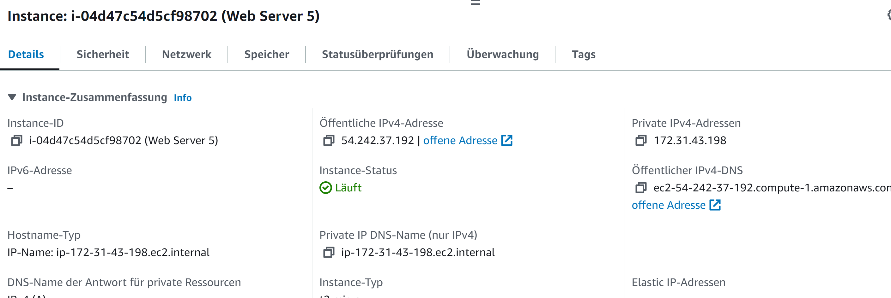

# M346
---
## KN_03

**A)**

<pre><code>#cloud-config
users:  # Benutzerkonfiguration
  - name: ubuntu  # Benutzername ist "ubuntu"
    sudo: ALL=(ALL) NOPASSWD:ALL  # sudo-Regeln für diesen Benutzer
    groups: users, admin  # Der Benutzer gehört zu den Gruppen "users" und "admin"
    home: /home/ubuntu  # Das Heimatverzeichnis des Benutzers ist "/home/ubuntu"
    shell: /bin/bash  # Der Benutzer verwendet die Bash-Shell
    ssh_authorized_keys:  # Autorisierte SSH-Schlüssel
      - ssh-rsa AAAAB3NzaC1yc2EAAAADAQABAAABAQC0WGP1EZykEtv5YGC9nMiPFW3U3DmZNzKFO5nEu6uozEHh4jLZzPNHSrfFTuQ2GnRDSt+XbOtTLdcj26+iPNiFoFha42aCIzYjt6V8Z+SQ9pzF4jPPzxwXfDdkEWylgoNnZ+4MG1lNFqa8aO7F62tX0Yj5khjC0Bs7Mb2cHLx1XZaxJV6qSaulDuBbLYe8QUZXkMc7wmob3PM0kflfolR3LE7LResIHWa4j4FL6r5cQmFlDU2BDPpKMFMGUfRSFiUtaWBNXFOWHQBC2+uKmuMPYP4vJC9sBgqMvPN/X2KyemqdMvdKXnCfrzadHuSSJYEzD64Cve5Zl9yVvY4AqyBD aws-key
ssh_pwauth: false  # SSH-Passwortauthentifizierung ist deaktiviert
disable_root: false  # Das Anmelden als Root-Benutzer ist aktiviert
package_update: true  # Die Paketliste wird beim Starten der Instanz aktualisiert
packages:  # Installierte Pakete
  - curl  # Installiert das Paket "curl"
  - wget  # Installiert das Paket "wget"
</code></pre>

**B)**

- Ein Screenshot der Details oder Liste der Instanz, welcher den verwendeten Key zeigt.
   

- Screenshot mit dem ssh-Befehl und des Resultats unter Verwendung des ersten Schlüssels.

- Screenshot mit dem ssh-Befehl und des Resultats unter Verwendung des zweiten Schlüssels.
  

- Screenshot mit dem Auszug aus dem Cloud-Init-Log.
  

---

**D)**

- Erstellen Sie einen Screenshot, der den Befehl und die CLI von mysql zeigt.
  

-  Erstellen
Sie einen Screenshot des Befehls und des Resultats. (telenet)
  

- Screenshot der URL und des Inhalts.
  
  
  
  
- Screenshot von Adminer
  
  
