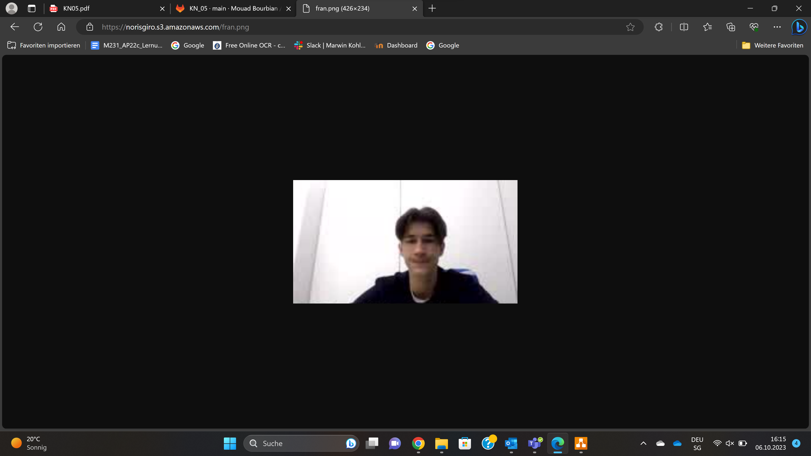

# M346
---
## KN_04

**A) Bild erstellen und auf S3 hosten**

   
   

<br>

**B)**

### Neue Cloud-Init-File

```yaml
#cloud-config
users:
  - name: ubuntu
    sudo: ALL=(ALL) NOPASSWD:ALL
    groups: users, admin
    home: /home/ubuntu
    shell: /bin/bash
    ssh_authorized_keys:
      - ssh-rsa AAAAB3NzaC1yc2EAAAADAQABAAABAQC0WGP1EZykEtv5YGC9nMiPFW3U3DmZNzKFO5nEu6uozEHh4jLZzPNHSrfFTuQ2GnRDSt+XbOtTLdcj26+iPNiFoFha42aCIzYjt6V8Z+SQ9pzF4jPPzxwXfDdkEWylgoNnZ+4MG1lNFqa8aO7F62tX0Yj5khjC0Bs7Mb2cHLx1XZaxJV6qSaulDuBbLYe8QUZXkMc7wmob3PM0kflfolR3LE7LResIHWa4j4FL6r5cQmFlDU2BDPpKMFMGUfRSFiUtaWBNXFOWHQBC2+uKmuMPYP4vJC9sBgqMvPN/X2KyemqdMvdKXnCfrzadHuSSJYEzD64Cve5Zl9yVvY4AqyBD aws-key
      - ssh-rsa AAAAB3NzaC1yc2EAAAADAQABAAACAQCz/wpWmsCxaQyuNFrIachc/q9nUdByoUcBcicl/wnKLFktKp6du9np9Uhmo4M0tVHNnWCt5uNEi2ks/0XEbg2J+4heuAAKEDr/TVbgabiWGclYKpEWZvmw8gsQwfpAKVG4aS2re7wB2uhw82ZqzJVpGm3ne+sNnz5uVrxN8HUnuR2OWJD6bA9l/fBmE6zdObVXgrCJGjZmVyB5GMeTDJKExgoBpLggZn9CNdu7Sx989xtNLehu6SWM+mGCq9Lcu7usiPG+SuEb8XynYaCOnv8+Oko6SYeJ9Omq/E7Eg6vZHqCbBQ81TIZrGKcikLmF2xP7EOprGOSPVewke7ak7vvmOI+p/RfIAyXj1+GYny+esk9G+qDRFXP9uiIlMfH1oGkQkztvSDMH+EOHqgY66NWQJPj83CaWH/euR0MROHXjm1ar3RuN9qcASAnzCOQQ1FMwFkpIV5x0NDRx0Zp1rLt8ZUFykmIuHZI4g9u6RdAiuWUxx9/eF0fXZa6Ju7GEMKeMtZxJJjmB/WCOylbkT+NPw5RcxgyRLKmUAicnYKXBmULY3pQM/Ui8KiCyJqRbLDBAR+XZYsZ7X5uhcuteu8KIfA2xEbInB4Q3c0DnnSih+GEC4pEbz+NOfeCpLJEn4gfyV1S9S08sG62ls8NPFociA9aWmE1oXfcqwvOkkYhxOw== aws-key
      - ssh-rsa AAAAB3NzaC1yc2EAAAADAQABAAABAQCb2pO/WZ7yHpLBCc5M9qx1bc/lTV+JjzqA0TO+Aq3IcX4HvE5y6TWh/RaxGMcVzmfSpQ2PrJn97EQ0AdMU5TmHj8SAUhvmie3vzK3y8TS0vcZGdLTemv7jn5HHhUmYQlR2QAWG/nSrzdlgPj/zBtSHrvNudNFqQ3PEYiq6IUMT45+XIgOZb2hXFbxXzg/W4xwpEpP58YT/2Pbhh2dOSnNxZZQ/hEZS3GmNlNQzIM8iF8qc1pPGiN+bRbo5DjGUu+VBmwCHvLM/iANfxtBVZelIDcsgxL1w4dIxmegSlcmG+idNdYOkRKyWf/tEBXH01kzv2PJ1lP28z5fqgdROFzG9 aws-key
ssh_pwauth: false

disable_root: false

package_update: true

packages:
  - apache2
  - php
  - libapache2-mod-php

write_files:
  - path: /var/www/html/image.php
    content: |
      <?php
      $ihrname = "Noris Girolimetto";
      ?>

      <html>
        <head>
          <title><?php echo($ihrname); ?></title>
        </head>
        <body>
          Das ist der Fran mit mir FaceTime.
          <br />
          
          <p>Dieses Bild kommt aus meinem "Bilder" Ordner.</p>
        </body>
      </html>

```
   

<br>

**C)**
   

<br>

**D)**

|                          | Typ   | Persistenz |
| ------------------------ | ----- | ---------- |
| EBS Root                 | hot   | nein         |
| EBS Zusätzliches Volumen | hot  | ja         |
| S3                       | warm  | ja         |

<br>

### EBS Root
**Begründung:** Das Betriebssystem ist ständig im Einsatz, da es für den reibungslosen Betrieb des Systems erforderlich ist. Es zeigt eine hohe Persistenz, da es gleichzeitig mit einer Instanz gelöscht wird, wenn diese Instanz gelöscht wird.

<br>

### EBS Zusätzliches Volumen
**Begründung:** Es ist "hot", da es die zusätzlichen Elemente zu EBS root darstellt, was das Betriebssystem ist. Es zeichnet sich durch Persistenz aus, da die Volumen nicht gelöscht werden.

<br>

### S3
**Begründung:** Die Bezeichnung "warm" trifft zu, da das Bild gelegentlich aufgerufen wird. Es zeigt Persistenz, da das Bild weiterhin existiert, solange es nicht gelöscht wird.
