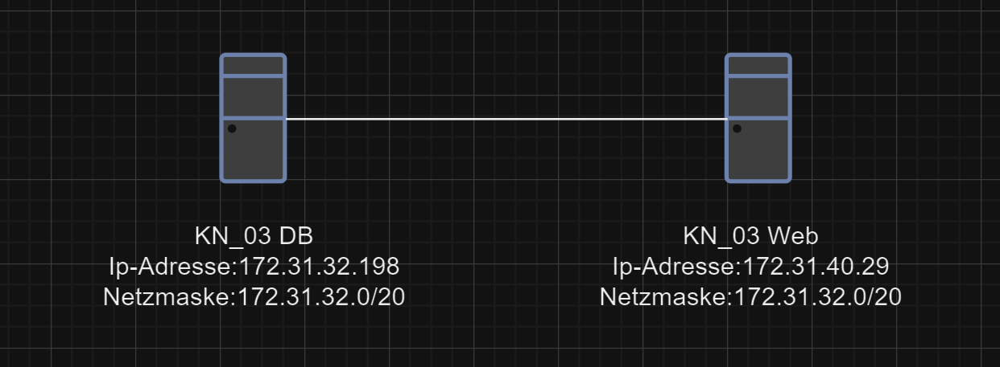
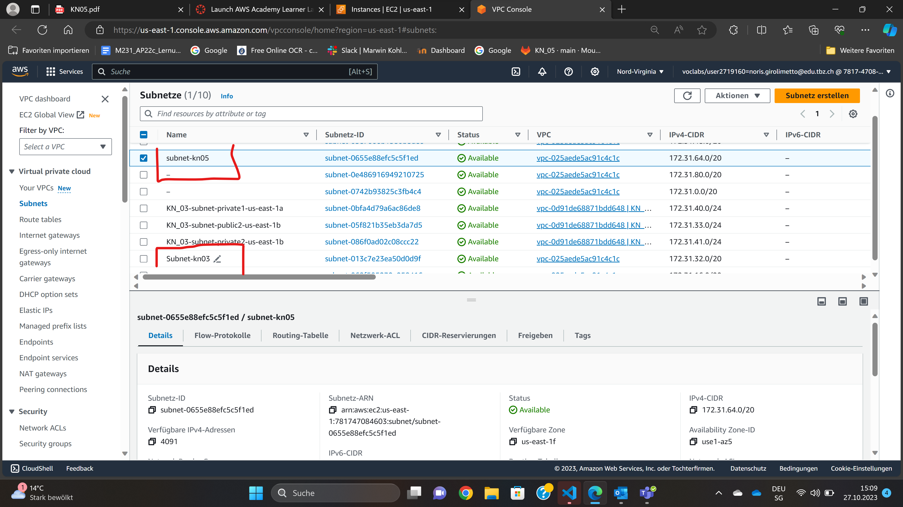
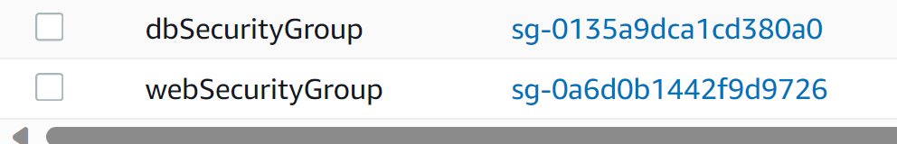
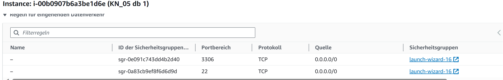
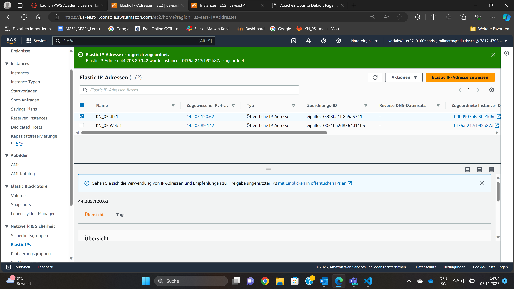
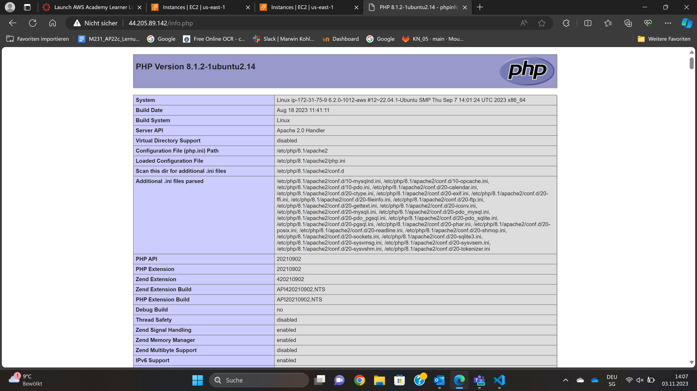
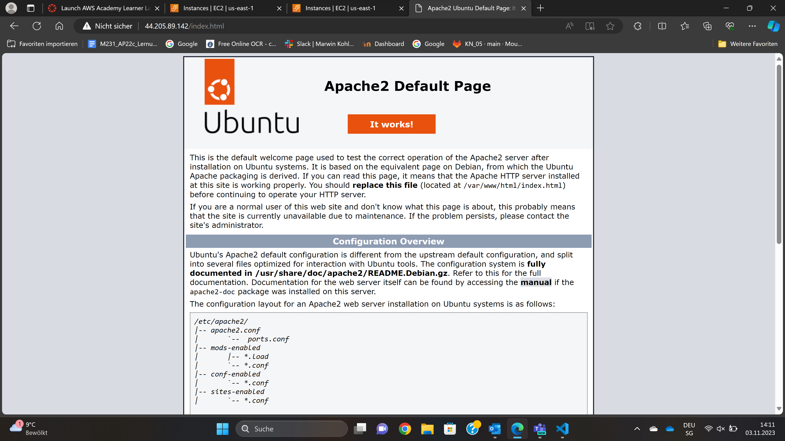
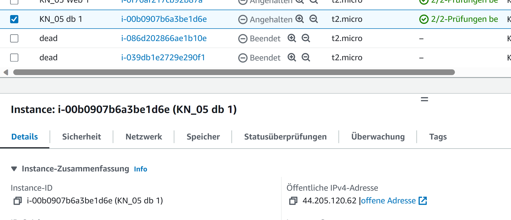
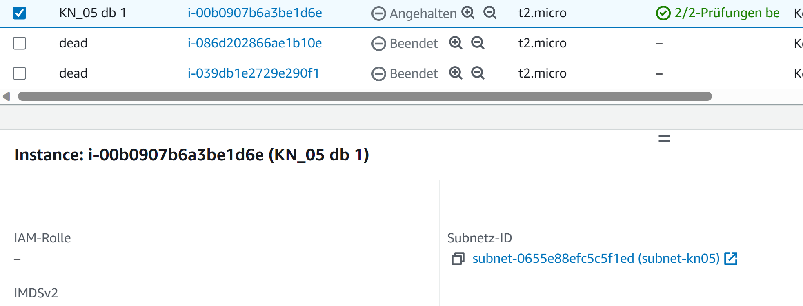
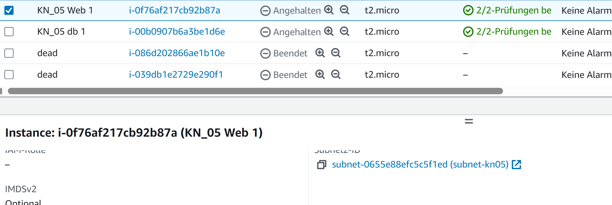

## KN05
 
---
### A
- Diagramm als Bild
   

 
### B
- Screenshot der Subnetzen, die die Namen zeigen

- Zwei definierte IPs für Web- und DB-Server/Instanz. Dazu braucht es keinen Screenshot, einfach nur die beiden IPs als Text.
1. 172.31.64.3
2. 172.31.64.4
 
### C
- Screenshot der Liste der Sicherheitsgruppe mit sprechenden Namen/Feldern

- Screenshot der Inbound-Regel für die DB-Sicherheitsgruppe.

- Screenshot der Liste der Elastic IPs mit sprechenden Namen.

- Zeigen Sie, dass Sie nun alle drei Seiten aufrufen können (index.html, info.php und db.php).

- Screenshot der Liste der Instanzen, wenn beide Instanzen gestoppt sind. Das Feld der öffentlichen IP und der Status (gestoppt) müssen sichtbar sein.

- Screenshot der Details beider Instanzen, so dass die Subnet ID sichtbar ist.

