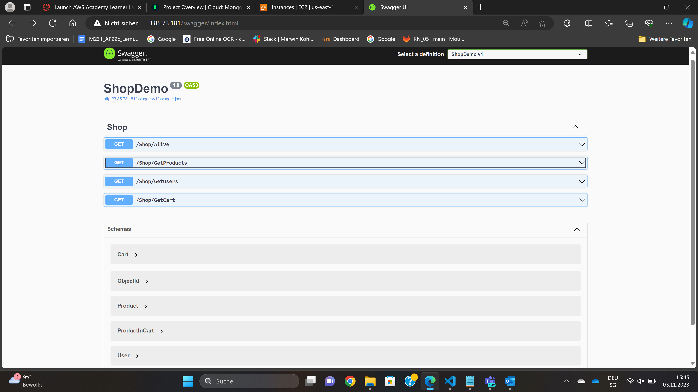
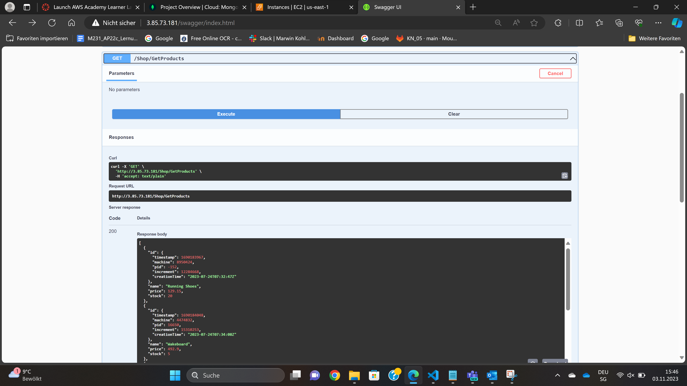
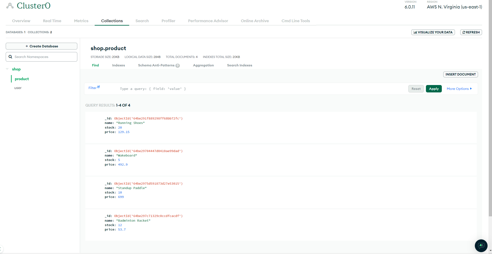

### KN_06

#### A)

- Ein Reverse-Proxy ist wie ein Server, der als Vermittler zwischen dem Client und dem realen Server fungiert. Es nimmt Clientanfragen entgegen und leitet sie an den internen Server weiter.

