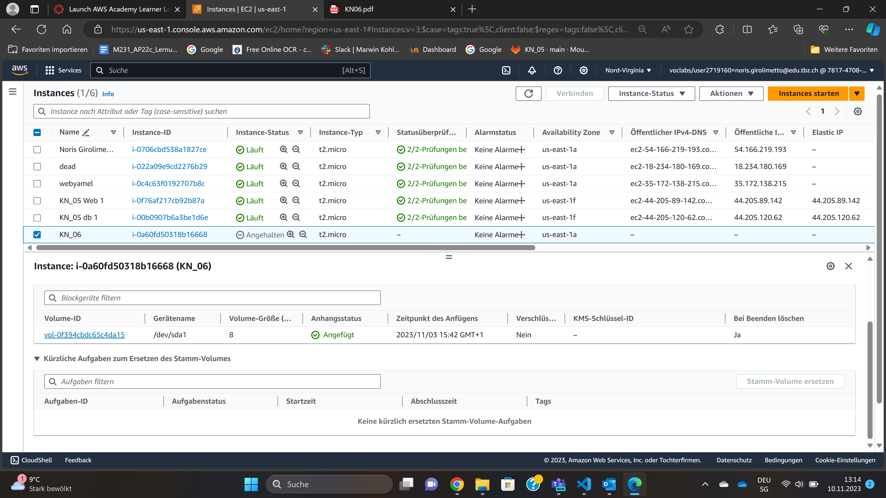
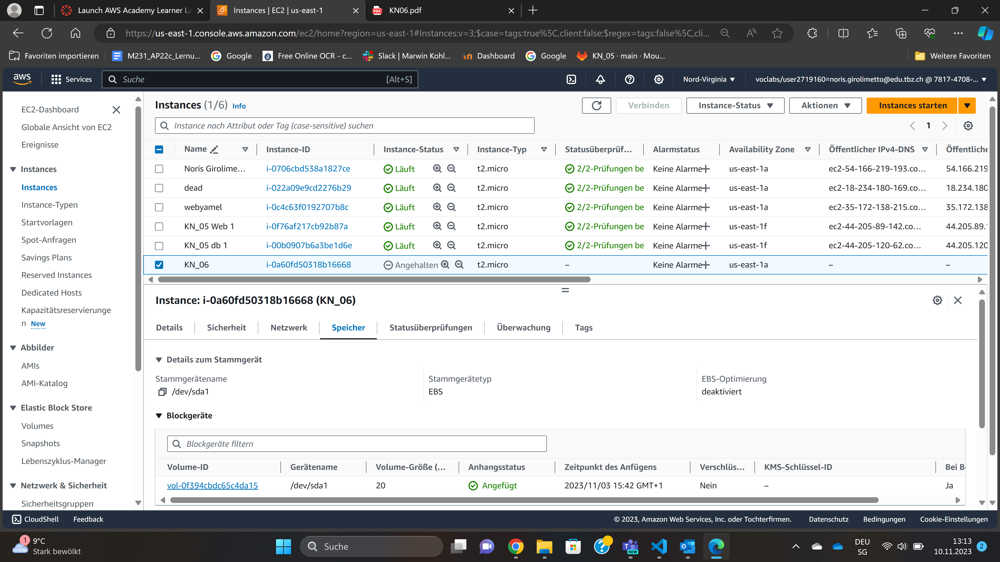
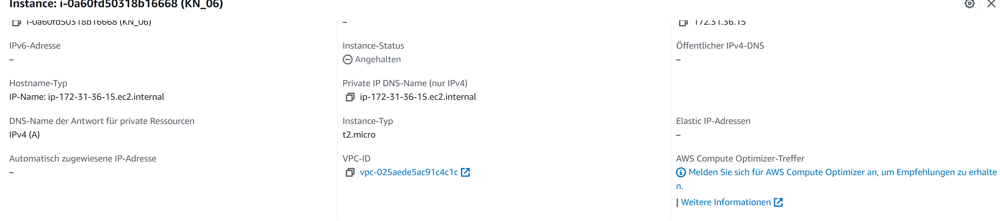
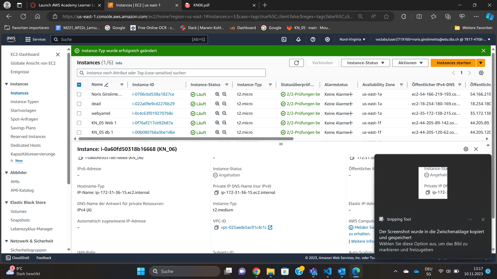
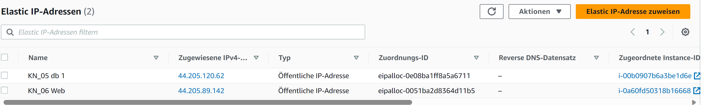
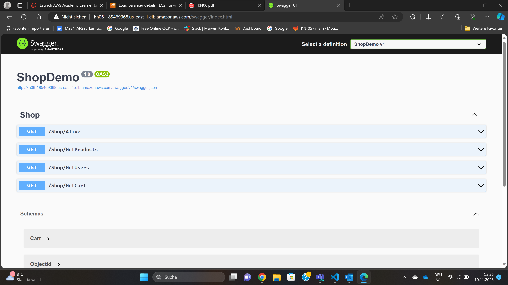
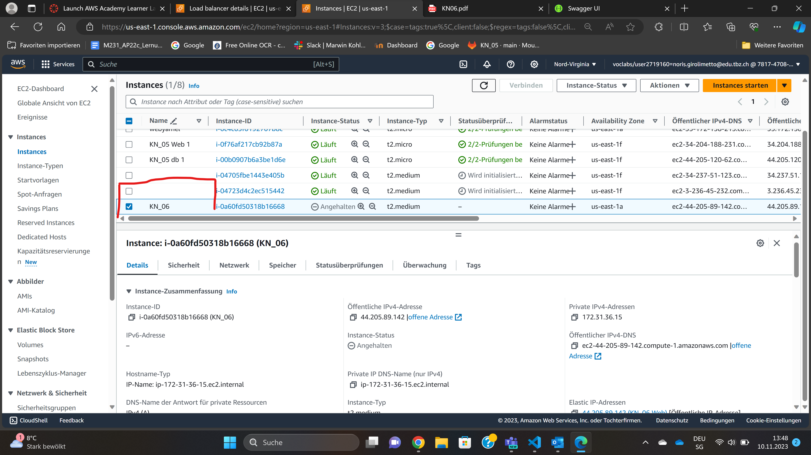

### KN_06

#### A)

- Ein Reverse-Proxy ist wie ein Server, der als Vermittler zwischen dem Client und dem realen Server fungiert. Es nimmt Clientanfragen entgegen und leitet sie an den internen Server weiter.

---

#### B)

Vorher

Nacher

Vorher 2

Nacher 2

Bei Speichergrösse spielt es keine rolle ob er abstellt ist oder nicht man kann ihn immer ändern. Bei InstanzenTyp muss er gestoppt sein weil es sonst nicht geht

---

#### C)

Elastic Ip

swagger

---

#### D)

Autoscaling

