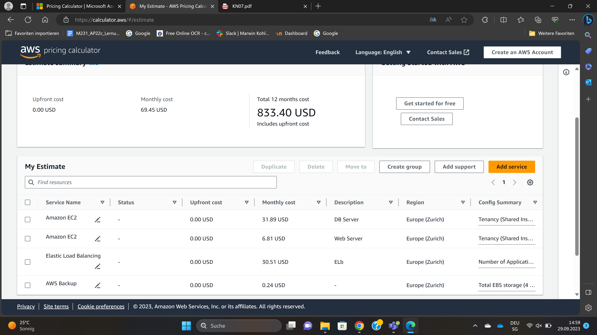
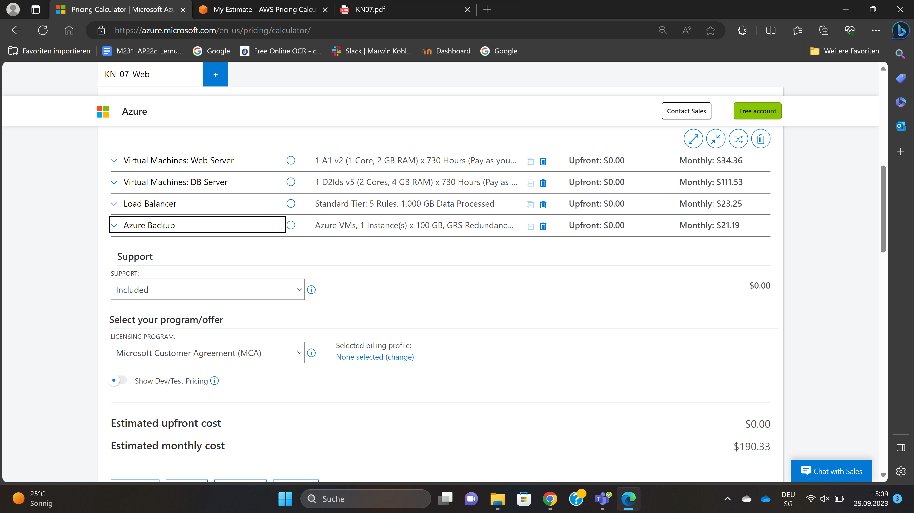
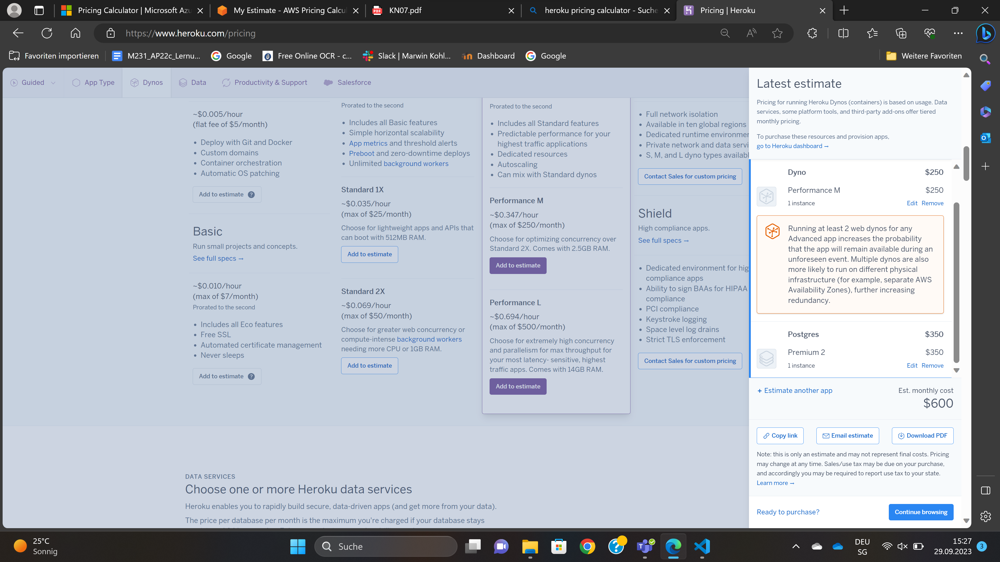
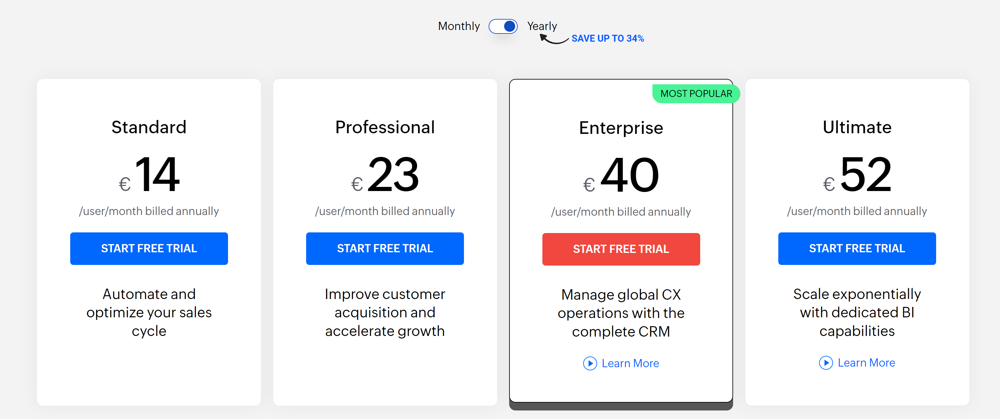
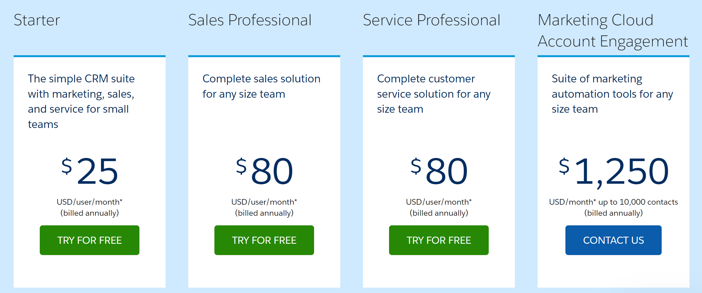

# M346
---
## KN_07

**A)**

**AWS und Azure**
1. 

Ich habe 1 Web Server mit 1 Core, 20GB Speicher, 2 GB RAM, Ubuntu Pro ausgewählt. Den rest habe ich auf Default gelassen. Bei Load Balancing habe ich "Load Balancer on Outposts" ausgewählt. Bei Backup habe ich einmal täglich für die letzten 7 Tage, Wöchentlich für den letzten Monat und Monatlich für die letzten drei Monate. 

ich habe auch noch das gleiche gemacht für DB. 1 DB Server mit 2 Cores, 100GB Speicher, 4 GB RAM, Ubuntu
 

Ihr bei Azure habe ich alles gleich gemacht nur das ich nicht selber die genauen Core, Speicher und Ram angeben.

 

**Heroku**
2. 

3. 

**Zoho CRM und SalesForce**

Zoho ist Kosteneffizienz für ein Unternehmen mit 16 Mitarbeitern und Zoho CRM ist bekannt für seine Benutzerfreundlichkeit und schnelle Implementierung.

Salesforce Sales Cloud ist extrem skalierbar und kann mit dem Wachstum Ihres Unternehmens mithalten. Es bietet eine breite Palette von Funktionen und Integrationen, die für grössere Unternehmen geeignet sind.

**SaaS**
 Einfache Nutzung, schnelle Implementierung, geringer Wartungsaufwand, keine Hardwareverwaltung erforderlich.

**IaaS**
Volle Kontrolle über die Infrastruktur, Skalierbarkeit, anpassbare Umgebung.

**PaaS**
Entwicklungsplattformen für die Anwendungsentwicklung, automatisierte Skalierung und Verwaltung.

**Gegenüberstellung**
Für ein kleines Unternehmen wie in der Aufgabe gestanden ist, das hauptsächlich CRM benötigt, die Nutzung von SaaS die praktikabelste und kosteneffizienteste Option. IaaS und PaaS sind in diesem Fall wahrscheinlich überdimensioniert und würden unnötige Komplexität und Kosten hinzufügen.

**B)**

**1. Wie stark unterscheiden sich die Angebote?**
Salesforce Sales Cloud bietet eine breitere Palette von Funktionen und Integrationen im Vergleich zu Zoho CRM.

Salesforce Sales Cloud ist in der Regel besser skalierbar

Salesforce Sales Cloud ist im vergleich zu Zoho CRM teurer

**2. Welches ist das billigste?**
In der Regel ist Zoho CRM billiger als Salesforce Sales Cloud, aber es hängt von den verschiedenen Faktoren ab, einschliesslich der Anzahl der Benutzer, der benötigten Funktionen.

**3. Wieso ist eines davon viel teurer? Ist es aber wirklich teurer?**

Die höheren Kosten von Salesforce können gerechtfertigt sein, wenn Sie die erweiterten Funktionen, die Skalierbarkeit und die Integrationen benötigen, die es bietet.